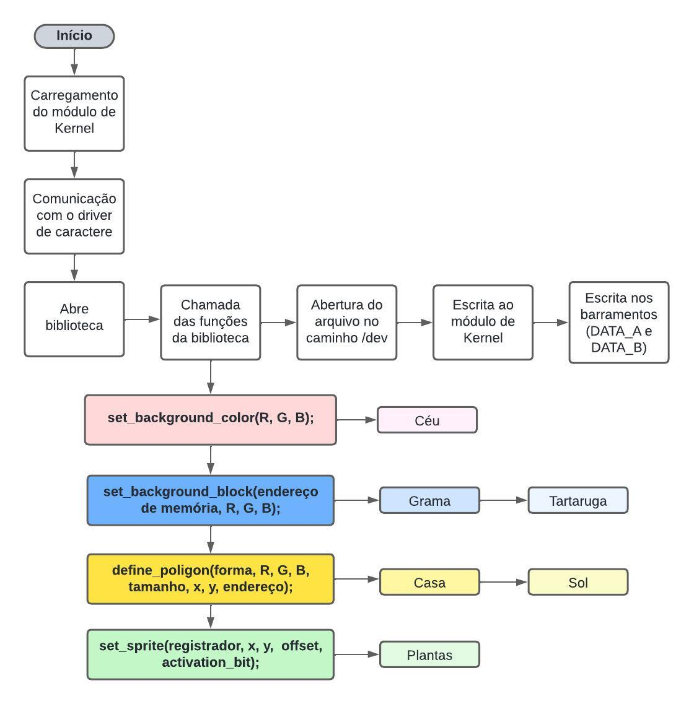

<h1 align="center"> Comunicação com Processador Gráfico </h1>


## Sobre

<p align="justify"> 
O projeto consistiu em desenvolver um módulo de Kernel Linux e uma biblioteca em linguagem C com o intuito de criar uma ponte de comunicação entre o processador gráfico que se encontra na FPGA contida na placa DE1-SoC e um programa a nível de usuário. 

</p>
<p align="justify"> 
A plataforma DE1-SoC combina um processador ARM (HPS) com um processador gráfico na FPGA. Essa integração permite que o HPS controle e interaja dinamicamente com o processador gráfico, possibilitando manipulação visual em um monitor VGA de 640×480 pixels.

</p>
<p align="justify"> 
A abordagem do projeto incluiu a implementação de funcionalidades para desenhar dois tipos de polígonos quadrados ou triângulos, renderização de sprites na tela VGA, além de desenhar background color e background block. Os módulos de Kernel Linux foram desenvolvidos para realizar a comunicação entre o HPS e a FPGA.

O objetivo principal foi estabelecer uma comunicação eficiente entre o processador gráfico na FPGA da plataforma DE1-SoC e o HPS disponível na mesma plataforma.
</p>


## Sumário
- [Softwares e Periféricos Utilizados](#softwares-e-periféricos-utilizados)
    - [Kit de desenvolvimento DE1 SoC](#kit-de-desenvolvimento-de1-soc)
    - [Linguagem C](#linguagem-c)
    - [Editor de Texto VSCode](#editor-de-texto-vscode)
    - [Compilador GCC](#compilador-gcc)
    - [Monitor Tubo CRT](#monitor-tubo-crt)
    - [Padrão VGA](#padrão-vga)
- [Arquitetura do Processador Gráfico](#arquitetura-do-processador-gragico)
    - [Unidade de Controle](#unidade-de-controle)
    - [Banco de Registradores](#banco-de-registradores)
    - [Módulo de Desenho](#módulo-de-desenho)
    - [Controlador VGA](#controlador-vga)
    - [Memória de Sprites](#memória-de-sprites)
    - [Memória de Background](#memória-de-background)
    - [Co-Processador](#co-processador)
    - [Instruções do Processador Gráfico](#instruções-do-processador-gráfico)
- [Detalhamento da Lógica de Comunicação](#detalhamento-da-lógica-de-comunicação)
- [Preparação do Ambiente e Execução do Projeto](#preparação-do-ambiente-e-execução-do-projeto)
- [Cenários de Testes](#cenários-de-testes)
- [Conclusão](#conclusão)
- [Referências](#referências)

## Equipe
- Jeferson Almeida da Silva Ribeiro
- Letícia Teixeira Ribeiro dos Santos
- Vitória Tanan dos Santos

## Softwares e Periféricos Utilizados
### Kit de desenvolvimento DE1-SoC

<p align="justify">
    A placa de desenvolvimento DE1-SoC é uma plataforma baseada no chip Altera Cyclone V SoC, que integra um processador ARM Cortex-A9 dual-core com uma FPGA da família Cyclone V. A DE1-SoC possui uma ampla variedade de periféricos e interfaces, incluindo:
</p>

- Interfaces de entrada/saída;
- Conexões de áudio de vídeo;
- Interface USB;
- Conexões Ethernet;
- LEDS, chaves e botões, entre outros.

<p align="center">
    
    <br>
    Figura 1. Placa de desenvolvimento DE1-SoC.
</p>

### Linguagem C
<p align="justify">
A linguagem C é uma linguagem de programação de alto nível que foi criada nos anos 70 com o propósito inicial de desenvolver sistemas operacionais. Nos dias atuais, ela permanece bastante popular, sendo amplamente utilizada em sistemas embarcados, no Kernel do Linux, aleḿ de também ter servido de influência para criação de outras linguagens como C#, C++ e Java. No projeto, essa linguagem foi utilizada para desenvolver o código fonte em conjunto com o compilador GCC para execução do programa.
</p>

### Editor de Texto VSCode
<p align="justify">
O Visual Studio Code é um editor de texto bastante popular que tem suporte para Windows, Linux e MacOS. Neste projeto, o VSCode foi utilizado para fins de edição do código em linguagem C, usufruindo do realce de sintaxe que o programa propociona.
</p>

### Compilador GCC
<p align="justify"> 
    GCC é sigla para GNU Compiler Collection, trata-se de um conjunto de compiladores para linguagem de programação C, C++, Objective-C, Fortran, Ada, Go, entre outras. Lançado em 1987, é o compilador padrão na maior parte das distribuições Linux além de estar disponível para muitos sistemas embarcados, incluindo chips baseados em ARM e Power ISA. No projeto, foi utilizado para compilar o código fonte escrito em linguagem C.
</p>

### Monitor Tubo CRT
<p align="justify"> 
O monitor utilizado é um modelo de tubo CRT (<i>Cathode Ray Tube</i>) da DELL, com uma tela de 17 polegadas e uma resolução máxima de 1280x1024 <i>pixels</i>. Ele possui uma interface VGA para conectar-se a placa de desenvolvimento DE1-SoC e exibir imagens.
</p>

<p align="center">
    
    <br>
    Figura 3. Monitor Tubo CRT
</p>


### Padrão VGA
<p align="justify"> 
     O padrão gráfico utilizado foi o VGA com resolução de 640x480 pixels. A placa DE1-SoC possui um conector D-SUB de 15 pinos para saída VGA, com sinais de sicronização gerados pelo FPGA Cyclone V Soc. Um DAC de vídeo triplo ADV7123 converte sinais digitais para analógicos, representando as cores vermelho, verde e azul, suportando até a resolução SXGA (1280x1024) a 100 MHz.
    </p>
    <p align="justify"> 
    A sicronização VGA envolve pulsos de sicronização horizontal (<i>hsync</i>) e vertical (<i>vsync</i>), com períodos específicos denominados <i>back porch</i>, <i>front porch</i> e intervalo de exibição para controlar os dados RGB. Após o pulso <i>hsync</i>, os sinais RGB são desligados (<i>back porch</i>), seguidos pelo intervalo de exibição onde os dados RGB ativam cada <i>pixel</i>, e depois desligados novamente (<i>front porch</i>) antes do próximo pulso <i>hsync</i>.
</p>
<p align="center">
    
    <br>
    Figura 2. Conexões entre o FPGA e o VGA
</p>

## Arquitetura e Instruções do Processador Gráfico
<p align="justify"> 
    O Processador Gráfico é responsável pela renderização e execução de um conjunto de instruções que permitem mover e controlar <i>sprites</i>, modificar a configuração do <i>background</i> da tela e renderizar polígonos, como quadrados e triângulos. As saídas do Processador Gráfico incluem os sinais de sicronização horizontal <i>(h_sync)</i> e vertical <i>(v_sync)</i> do monitor VGA, além dos bits de cores RGB <i>(Red, Green, Blue)</i>. A Figura 4 ilustra a arquitetura completa do processador gráfico, conforme detalhado no TCC.
</p>
<p align="center">
    
    <br>
    Figura 4. Estrutura Interna do Processador Gráfico. (Fonte: TCC de [Gabriel B. Alves])
</p>

### Unidade de Controle
<p align="justify"> 
A Unidade de Controle do processador gráfico da placa DE1-SoC desempenha um papel fundamental na gestão das operações internas do processador, operando como uma Máquina de Estados que coordena o fluxo de instruções:
</p>

- Leitura de Instruções: Responsável por ler as instruções armazenadas na memória, que incluem comandos para modificar o <i>background</i>, movimentar <i>sprites</i> e renderizar polígonos.
- Decodificação de Instruções: Interpreta os bits das instruções para determinar as ações específicas a serem realizadas pelo processador gráfico.
- Execução de Instruções: Realiza as operações indicadas pelas instruções, incluindo a alteração do <i>background</i>, renderização de polígonos e movimento de <i>sprites</i>.

### Banco de Registradores
<p align="justify"> 
O Banco de Registradores é composto por 32 registradores. O primeiro é reservado para a cor de fundo da tela, enquanto os 31 restantes são dedicados ao armazenamento das informações dos <i>sprites</i>. Essa organização permite que o processador gráfico temporariamente armazene informações essenciais de cada <i>sprite</i>, como coordenadas, offset de memória de um bit de ativação, possibilitando o gerenciamento de até 31 <i>sprites</i> simultaneamente em um único <i>frame</i> de tela.
</p>

### Módulo de Desenho
<p align="justify"> 
O Módulo de Desenho gerencia todo o processo de renderização dos <i>pixels</i> no monitor VGA. Ele converte e envia os dados de cor RGB para cada <i>pixel</i>, garantindo a precisão da imagem exibida no monitor. A utilização de uma arquitetura de <i>Pipeline</i> permite ao módulo processar múltiplas instruções ao mesmo tempo, aumentando a eficiência do processamento e previnindo distorções na saída do monitor VGA.
</p>

### Controlador VGA
<p align="justify"> 
O Controlador VGA é responsável por gerar os sinais de sicronização vertical (<i>vsync</i>) e horizontal (<i>hsync</i>), essenciais para a exibição correta dos <i>frames</i> no monitor. Estes sinais são fundamentais para coordenar o processo de varredura do monitor, que ocorre da esquerda para a direita e de cima para baixo. O controlador também fornece as coordenadas X e Y para o processo de varredura, assefurando que cada linha do <i>frame</i> seja renderizada corretamente. Considerando os tempos de sincronização vertical e horizontal, cada tela é atualizada a cada 16,768 ms, resultando em uma taxa de aproximadamente 60 <i>frames</i> por segundo. O módulo coordena ainda a geração dos sinais de sicronização para evitar distorções e garantir que a exibição esteja dentro dos padrões de resolução e taxa de atualização estabelecidos.
</p>

### Memória de Sprites
<p align="justify"> 
A memória de <i>sprites</i> é responsável por armazenar os <i>bitmapes</i> de cada <i>sprite</i>. Ela possui uma capacidade de 12.800 palavras de 9 bits, sendo 3 bits destinados para cada componente de cor RBG. Cada <i>sprite</i> tem um tamanho fixo de 20x20 <i>pixels</i>, ocupando 400 posições de memória. Isso permite que até 32 <i>sprites</i> distintos sejam armazenados simultaneamente para uso. Esta estrutura é essencial para a correta exibição e manipulação dos <i>sprites</i> na tela.
</p>

### Memória de Background
<p align="justify">
A memória de <i>background</i> é usada para modificar pequenas partes do fundo da tela. Ela consiste em 4.800 palavras de 9 bits cada, com 3 bits destinados a cada componente de cor RGB. Esta configuração permite ajustar e atualizar dinamicamente seções específicas do <i>background</i>, garantindo flexibilidade e precisão na exibição gráfica.
</p>

### Co-Processador
<p align="justify">
O Co-Processador é responsável por gerenciar a construção de polígonos convexos, como quadrados e triângulos. Estes polígonos são renderizados na tela do monitor VGA, trabalhando em conjunto com os sprites e o background. A arquitetura do Co-Processador permite a execução de cálculos necessários para determinar a posição e as características desses polígonos. Ao fazer isso, ele assegura que os polígonos sejam integrados corretamente com outros elementos gráficos, proporcionando uma renderização precisa e sincronizada. Isso é essencial para a exibição coerente e harmoniosa de todos os componentes visuais na tela.
</p>

### Instruções do Processador Gráfico
<p align="justify">

- Escrita no Banco de Registradores (WBR): Essa instrução armazena informações sobre a cor base do <i>background</i> e dos <i>sprites</i>. Para que o processador gráfico execute essa instrução, o opcode é configurado como 0000. Dos 32 registradores dispobíveis, o primeiro é utilizado para armazenar as informações do <i>background</i>, enquanto os outros 31 registradores guardam informações dos <i>sprites</i>.
A estrutura para configurar os campos da cor base do background está representada na ##Figura X##, onde os campos R, G e B configuram a cor base. A configuração dos <i>sprites</i> está na ###Figura X###, onde o <i>sprite</i> é definido pelo offset, que indica o endereço de memória, os campos X e Y definem as coordenadas de localização dos <i>sprites</i>, e o campo sp serve para habilitar ou desabilitar um <i>sprite</i>.
</p>

<p align="center">
    
    <br>
    Figura X. Instruções WBR para alteração da cor base do <i>background</i>. (Fonte: TCC de [Gabriel B. Alves])
</p>

<p align="center">
    
    <br>
    Figura X. Instruções WBR para configurar um <i>sprite</i>. (Fonte: TCC de [Gabriel B. Alves])
</p>

<p align="justify">

- Escrita na Memória de Sprites (WSM): Essa instrução armazena ou altera o conteúdo presente na memória de sprites. Para que o processador gráfico execute essa instrução, o opcode é configurado como 0001. A instrução é representada na Figura X. O campo endereço de memória especifica a localização do sprite na memória a ser editado, enquanto os campos R, G e B definem as novas cores para o local desejado.
</p>

<p align="center">
    
    <br>
    Figura X. Instruções WSM para editar o conteúdo na memória de <i>sprites</i>. (Fonte: TCC de [Gabriel B. Alves])
</p>


<p align="justify">

- Escrita na Memória de Background (WBM): Essa instrução armazena ou altera o conteúdo na Memória de Background. Para que o processador gráfico execute essa instrução, o opcode é configurado como 0010. O campo endereço de memória corresponde a um bloco 8x8 pixels. Com uma resolução de 640x480 pixels, a tela é dividida em 80x60 blocos, conforme representado na Figura 11.
</p>

<p align="center">
    
    <br>
    Figura X. Divisão da área do <i>Background</i>. (Fonte: TCC de [Gabriel B. Alves])
</p>

<p align="justify">

- Definição de um Polígono (DP): Essa instrução é utilizada para renderizar polígonos, conforme mostrado na Figura X. Para que o processador gráfico execute essa instrução, o <b>opcode</b> é configurado como 0011. O campo <b>endereço</b> indica a posição de memória onde a instrução será armazenada. Os campos <b>ref_point X</b> e <b>ref_point Y</b> definem as coordenadas para a renderização do polígono. O campo tamanho especifica as dimensões do polígono (base e altura), conforme indicado na Tabela I. As componentes <b>RGB</b> determinam a cor do polígono, e o campo <b>forma</b> define se o polígono será um quadrado (0) ou triângulo (1).
</p>

<p align="center">
    
    <br>
    Figura X. Instruções DP para definição de um polígono. (Fonte: TCC de [Gabriel B. Alves])
</p>

<p align="center">
    
    <br>
    Figura X. Dimensões dos Polígonos. (Fonte: TCC de [Gabriel B. Alves])
</p>

## Detalhamento da Lógica de Comunicação
### Mapeamento de Memória
<p align="justify"> 
Para que haja comunicação entre hardware e software no ambiente Linux, é necessário aplicar a técnica de mapeamento de memória. Devido ao Linux utilizar um sistema de memória virtual, os endereços físicos do hardware não ficam disponíveis para acesso direto em programas em execução. O Kernel disponibiliza a função mmap que pode ser usada em conjunto com o arquivo /dev/mem e assim mapear os endereços físicos para endereços virtuais, permitindo o acesso ao hardware.
</p>
<p align="justify"> 
No contexto do projeto, essa técnica foi usada para ter acesso aos barramentos Data A e Data B do Processador Gráfico, que se encontra na FPGA. O processador ARM (HPS) possui as pontes de acesso HPS-to-FPGA e LightWeight-to-FPGA, que são mapeadas para regiões no espaço de memória do HPS, ao utilizar uma delas é possível acessar os barramentos através da soma da ponte + offset, que representa o endereço base.
</p>

### Driver de Caractere
<p align="justify">
Para que um usuário tenha acesso a dispositivos de hardware, é necessário interagir com arquivos especiais de dispositivo, que estão agrupados no diretório /dev. As chamadas de sistema como open, read, write, close, lseek, mmap, entre outras, são usadas para interagir com esses dispositivos. Quando tais chamadas são realizadas, o sistema operacional as redireciona para o driver do dispositivo associado ao dispositivo físico.
</p>
<p align="justify">
O driver de dispositivo é um componente do kernel que interage diretamente com o hardware. No caso dos drivers de dispositivos de caractere, eles gerenciam uma pequena quantidade de dados e o acesso a esses dados não requer operações frequentes de busca. Neste caso, as chamadas de sistema são encaminhadas diretamente para os drivers de dispositivo de caractere, que manipulam a comunicação com o hardware de maneira eficiente.
</p>
<p align="justify">
Para o projeto, foi implementado as funções open, read, write e release. As funções que formam as expressões a serem passadas para os barramentos Data A e Data B também foram incluídas no driver.
O fluxo de escrita nos barramentos utilizando a linguagem C acontece da seguinte forma:

1. Programa de usuário chama uma função da biblioteca passando parâmetros, como por exemplo ```set_background_color(1, 2, 3)```
2. A função equivalente na biblioteca abre o arquivo especial no diretório /dev através da função **open()**
3. É utilizada a função **sprintf()** para formar uma string contendo todos os valores que vão ser enviados pro driver e passa pra variável buffer. E a **write()** pra escrever o que está no buffer direto no driver. Ao executar essa ação, a função write do driver é chamada.
```c
sprintf(buffer, "%d %d %d %d %d", WSM, R, G, B, endereco_memoria);  
int bytesWritten = write(fd, buffer, strlen(buffer)); 
```
3. Quando a função **write** do driver é chamada, há uma lógica condicional que verifica qual instrução foi solicitada, e a partir daí chama a função respectiva para formar a expressão a ser passada para os barramentos e enviar o pulso de clock para efetivar a escrita. A identificação das instruções se dão através de constantes, por exemplo, a WBR é identificada pelo número 1.
</p>


## Execução do Projeto
<p align="justify">
Para que todo o fluxo funcione corretamente, alguns comandos precisam ser executados. A partir da pasta raiz do projeto, executar:

```bash
make
make lib
```
Isso irá inserir o módulo no kernel e criar o arquivo especial na pasta /dev. Também irá compilar a biblioteca e o arquivo principal (main)
<p>

### Fluxograma da Solução Geral do Projeto
[...]

<p align="center">
    
    <br>
    Figura X. Fluxograma da Solução Geral do Projeto.
</p>

## Cenário de Testes

<p align="justify">
Os cenários de testes foram desenvolvidos para verificar as funções do projeto e se as mesmas estavam se comportando conforme o esperado. Abaixo está cada cenário de teste realizado:
<P>
<p align="justify">
<b>Exibição da cor do background da tela:</b> 

Para configurar a cor de fundo da tela, foi utilizada a função ```set_background_color(int R, int G, int B)```. Essa função escreve no registrado necessário para definir a cor de fundo. No projeto, a cor escolhida foi azul, representando o céu diurno. A figura abaixo exemplifica como ficaria a cor do background no monitor

<p align="center">
    
    <br>
    Figura X. Exemplo da cor de Background no monitor
</p>
<p>
<p align="justify">
<b>Desenho de background blocks:</b> 

O desenho de blocos no background foi realizado utilizando a função ```set_background_block(int endereco_memoria, int R, int G, int B)```. Essa função permite desenhar elementos como a grama e a tartaruga (exceto suas patas) na memória de background. Para facilitar o processo, um laço ```for``` foi utilizado para definir as áreas na memória onde esses blocos deveriam ser desenhados. A figura X mostra um exemplo de como deveria ficar o desenho usando os background blocks.

<p align="center">
    
    <br>
    Figura X. Exemplo do desenho utilizando apenas os blocos
<p>

<p align="justify">
<b>Desenho de polígonos:</b>

Para renderizar e definir polígonos na tela, foi utilizada a função ```define_poligon(int forma, int R, int G, int B, int tamanho, int x, int y, int endereco)```. Polígonos foram fundamentais para desenhar elementos como o sol, as patas da tartaruga e a estrutura da casa no projeto. Abaixo, na figura X está presente um exemplo dos polígonos utilizados no desenho

<p align="center">
    
    <br>
    Figura X. Polígonos utilizados no desenho
<p>
<p>

<p align="justify">
<b>Configuração de sprites:</b> 

A função ```set_sprite(int reg, int x, int y, int offset, int activation_bit)``` foi empregada para configurar e exibir sprites na tela. A figura X demonstra um exemplo final do desenho com sprites.

<p align="center">
    
    <br>
    Figura X. Exemplo desenho final com os sprites
<p>
<p>


